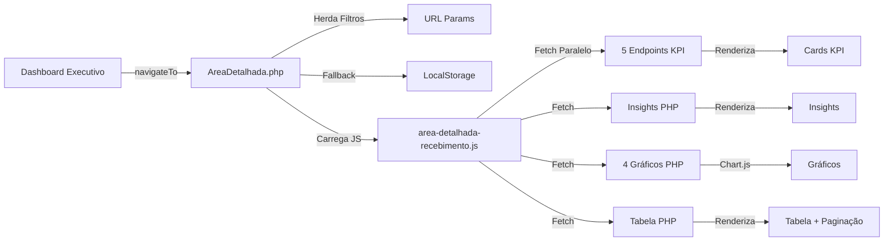

# Visão por Área - Detalhamento Operacional

## 📋 Visão Geral

Sistema de drill-down operacional que permite visualização profunda de cada área do Dashboard Executivo. Cada área (Recebimento, Análise, Reparo, Qualidade) possui sua própria página de detalhamento com KPIs específicos, insights automáticos, gráficos e tabelas operacionais.

## 🎯 Objetivos

- **Visibilidade Operacional**: Painel detalhado de cada área com métricas específicas
- **Insights Automáticos**: Geração inteligente de alertas e recomendações
- **Análise Temporal**: Gráficos de evolução para identificar tendências
- **Rastreabilidade**: Tabela completa de todos os registros operacionais

## 📁 Estrutura de Arquivos

### Frontend

```
DashBoard/frontendDash/
├── AreaDetalhada.php              # Template universal para todas as áreas
└── cssDash/
    └── area-detalhada.css         # Estilos completos (glassmorphism)
└── jsDash/
    ├── area-detalhada-recebimento.js    # ✅ IMPLEMENTADO
    ├── area-detalhada-analise.js        # ⏳ Pendente
    ├── area-detalhada-reparo.js         # ⏳ Pendente
    └── area-detalhada-qualidade.js      # ⏳ Pendente
```

### Backend - Recebimento (✅ Completo)

```
DashBoard/backendDash/recebimentoPHP/
├── kpi-remessas-recebidas.php         # KPI: Total de remessas
├── kpi-equipamentos-recebidos.php     # KPI: Total de equipamentos
├── kpi-tempo-ate-analise.php          # KPI: Tempo médio até análise
├── kpi-taxa-envio-analise.php         # KPI: % enviadas para análise
├── kpi-backlog-atual.php              # KPI: Equipamentos pendentes
├── insights-recebimento.php           # Geração de insights automáticos
├── grafico-volume-diario.php          # Gráfico: Evolução temporal
├── grafico-por-setor.php              # Gráfico: Distribuição por setor
├── grafico-operacoes.php              # Gráfico: Fluxo de operações
├── grafico-tempo-medio.php            # Gráfico: Tempo por operador
└── tabela-detalhada.php               # Tabela operacional completa
```

### Backend - Outras Áreas (⏳ Pendente)

```
DashBoard/backendDash/
├── analisePHP/        # Endpoints para área de Análise
├── reparoPHP/         # Endpoints para área de Reparo
└── qualidadePHP/      # Endpoints para área de Qualidade
```

## 🔗 Navegação

### Entrada no Sistema

A navegação para as páginas de detalhamento é feita através da função `navigateTo()` no **DashboardExecutivo.php**:

```javascript
// Em DashboardExecutivo.php (linha ~1691)
function navigateTo(destino) {
    // Obter filtros atuais
    const filtroInicio = document.getElementById('filtroInicio')?.value || '';
    const filtroFim = document.getElementById('filtroFim')?.value || '';
    const filtroSetor = document.getElementById('filtroSetor')?.value || '';
    const filtroOperador = document.getElementById('filtroOperador')?.value || '';
    
    // Construir URL com filtros
    let params = new URLSearchParams();
    if (filtroInicio) params.append('inicio', filtroInicio);
    if (filtroFim) params.append('fim', filtroFim);
    if (filtroSetor) params.append('setor', filtroSetor);
    if (filtroOperador) params.append('operador', filtroOperador);
    
    const queryString = params.toString() ? '&' + params.toString() : '';
    
    // Navegação por área
    switch(destino) {
        case 'recebimento':
            window.location.href = `AreaDetalhada.php?area=recebimento${queryString}`;
            break;
        case 'analise':
            window.location.href = `AreaDetalhada.php?area=analise${queryString}`;
            break;
        case 'reparo':
            window.location.href = `AreaDetalhada.php?area=reparo${queryString}`;
            break;
        case 'qualidade':
            window.location.href = `AreaDetalhada.php?area=qualidade${queryString}`;
            break;
    }
}
```

### URLs de Acesso

```
# Recebimento (com filtros)
/DashBoard/frontendDash/AreaDetalhada.php?area=recebimento&inicio=2024-01-01&fim=2024-01-31

# Análise
/DashBoard/frontendDash/AreaDetalhada.php?area=analise

# Reparo
/DashBoard/frontendDash/AreaDetalhada.php?area=reparo

# Qualidade
/DashBoard/frontendDash/AreaDetalhada.php?area=qualidade
```

### Botões de Acionamento

Para adicionar navegação aos cards do Dashboard Executivo, adicione `onclick`:

```html
<!-- Exemplo: Card de Recebimento -->
<div class="area-card" onclick="navigateTo('recebimento')">
    <div class="area-icon" style="color: var(--accent-blue);">
        <i class="fas fa-truck"></i>
    </div>
    <h3>Recebimento</h3>
    <div class="area-stats">...</div>
</div>
```

## 🎨 Estrutura Visual

Cada página de detalhamento segue esta hierarquia fixa:

### 1. **Header Contextual**
- Botão "Voltar" (preserva filtros)
- Ícone e título da área
- Informação do período filtrado

### 2. **Seção KPIs** (5 cards)
- KPIs específicos da área
- Valores atuais
- Variação vs período anterior
- Estado visual (success/warning/critical)

### 3. **Seção Insights** (até 3 cards)
- Análises automáticas geradas pelo backend
- Alertas e recomendações
- Identificação de gargalos
- Sugestões de ação

### 4. **Seção Gráficos** (4 gráficos)
- **Bloco A**: Evolução Temporal (linha/barras)
- **Bloco B1**: Distribuição 1 (pizza/rosca)
- **Bloco B2**: Distribuição 2 (barras)
- **Bloco C**: Eficiência (barras/linha)

### 5. **Tabela Operacional**
- Busca em tempo real
- Ordenação por colunas
- Paginação (20 itens por página)
- Registro completo de operações

### 6. **Empty State**
- Exibido quando não há dados no período
- Sugestão de ajuste de filtros

## 🔧 Especificação Técnica

### Configuração de Áreas

```php
// Em AreaDetalhada.php (linhas 28-52)
$areasConfig = [
    'recebimento' => [
        'titulo' => 'Recebimento - Análise Detalhada',
        'icone' => 'fa-truck',
        'cor' => 'var(--accent-blue)'
    ],
    'analise' => [
        'titulo' => 'Análise - Painel Operacional',
        'icone' => 'fa-search',
        'cor' => 'var(--accent-cyan)'
    ],
    'reparo' => [
        'titulo' => 'Reparo - Controle de Produção',
        'icone' => 'fa-tools',
        'cor' => 'var(--accent-purple)'
    ],
    'qualidade' => [
        'titulo' => 'Qualidade - Gestão de Inspeção',
        'icone' => 'fa-clipboard-check',
        'cor' => 'var(--accent-green)'
    ]
];
```

### Herança de Filtros

O sistema mantém contexto dos filtros através de 3 níveis:

1. **URL Parameters**: `?inicio=2024-01-01&fim=2024-01-31&setor=TI`
2. **LocalStorage**: Fallback se URL não contiver filtros
3. **Default**: Últimos 30 dias se nenhum filtro disponível

```javascript
// Em AreaDetalhada.php (linhas 238-268)
function obterFiltros() {
    const urlParams = new URLSearchParams(window.location.search);
    
    let inicio = urlParams.get('inicio');
    let fim = urlParams.get('fim');
    let setor = urlParams.get('setor');
    let operador = urlParams.get('operador');
    
    // Fallback para localStorage
    if (!inicio || !fim) {
        const filtrosArmazenados = localStorage.getItem('dashboardFiltros');
        if (filtrosArmazenados) {
            const filtros = JSON.parse(filtrosArmazenados);
            inicio = inicio || filtros.inicio;
            fim = fim || filtros.fim;
            setor = setor || filtros.setor;
            operador = operador || filtros.operador;
        }
    }
    
    // Default: últimos 30 dias
    if (!inicio || !fim) {
        const hoje = new Date();
        const trintaDiasAtras = new Date(hoje.getTime() - (30 * 24 * 60 * 60 * 1000));
        inicio = trintaDiasAtras.toISOString().split('T')[0];
        fim = hoje.toISOString().split('T')[0];
    }
    
    return { inicio, fim, setor, operador };
}
```

### Padrão de Resposta dos Endpoints

Todos os endpoints seguem o padrão definido em `endpoint-helpers.php`:

```php
// Sucesso
sendSuccess([
    'valor' => 150,
    'unidade' => 'remessas',
    'periodo' => [
        'inicio' => '2024-01-01',
        'fim' => '2024-01-31'
    ],
    'referencia' => [
        'valor' => 120,
        'variacao' => 25.0,  // percentual
        'estado' => 'success'  // success|warning|critical|neutral
    ]
]);

// Erro
sendError('Mensagem de erro', 400);
```

### Estados de KPI

Os KPIs podem ter 4 estados visuais:

- **success**: Verde - Métrica positiva
- **warning**: Laranja - Atenção necessária
- **critical**: Vermelho - Problema grave
- **neutral**: Azul - Dentro da normalidade

## 📊 KPIs por Área

### Recebimento (✅ Implementado)

1. **Remessas Recebidas**: `COUNT(DISTINCT id)` - Total de remessas
2. **Equipamentos Recebidos**: `SUM(quantidade)` - Total de equipamentos
3. **Tempo Médio até Análise**: `AVG(DATEDIFF(analise, recebimento))` - Dias
4. **% Enviadas para Análise**: `(enviadas / recebidas) * 100` - Percentual
5. **Backlog Atual**: `COUNT(não enviadas)` - Equipamentos pendentes

### Análise (⏳ Pendente)

1. **Backlog em Análise**: Equipamentos aguardando análise
2. **Equipamentos Analisados**: Total processado no período
3. **Taxa de Aprovação**: % aprovados sem reparo
4. **Tempo Médio de Análise**: Dias por equipamento
5. **Valor Estimado em Análise**: Soma de orçamentos

### Reparo (⏳ Pendente)

1. **Backlog em Reparo**: Equipamentos aguardando reparo
2. **Equipamentos Reparados**: Total concluído
3. **Taxa de Sucesso**: % reparos bem-sucedidos
4. **Tempo Médio de Reparo**: Dias por equipamento
5. **Valor de Reparos**: Soma de custos/valores

### Qualidade (⏳ Pendente)

1. **Equipamentos Avaliados**: Total em QA
2. **% Sem Conserto**: Equipamentos irrecuperáveis
3. **Taxa de Retrabalho**: % voltou para reparo
4. **Top Causas de Falha**: Principais problemas
5. **Top Modelos Problemáticos**: Equipamentos recorrentes

## 🎨 Design System

### Cores e Tokens CSS

```css
/* Cores primárias */
--accent-blue: #388bfd;      /* Recebimento */
--accent-cyan: #11cfff;      /* Análise */
--accent-purple: #8b5cf6;    /* Reparo */
--accent-green: #10b981;     /* Qualidade */
--accent-orange: #f59e0b;    /* Warnings */
--accent-red: #ef4444;       /* Critical */

/* Glassmorphism */
--glass-dark: rgba(17, 24, 39, 0.5);
--glass-darker: rgba(17, 24, 39, 0.7);
--glass-darkest: rgba(17, 24, 39, 0.85);

/* Bordas */
--border-subtle: rgba(56, 139, 253, 0.15);
--border-medium: rgba(56, 139, 253, 0.25);

/* Textos */
--text-primary: rgba(232, 244, 255, 0.95);
--text-secondary: rgba(168, 197, 224, 1);
--text-muted: rgba(148, 163, 184, 0.7);
```

### Componentes Reutilizáveis

**KPI Card**:
```html
<div class="kpi-card" data-estado="success">
    <div class="kpi-header">
        <div class="kpi-icon">
            <i class="fas fa-truck"></i>
        </div>
    </div>
    <div class="kpi-label">Remessas Recebidas</div>
    <div class="kpi-value">
        150
        <span class="kpi-unit">remessas</span>
    </div>
    <div class="kpi-comparison positive">
        <span>↑ 25.0%</span>
        <span>vs período anterior</span>
    </div>
</div>
```

**Insight Card**:
```html
<div class="insight-card warning">
    <div class="insight-icon">
        <i class="fas fa-hourglass-half"></i>
    </div>
    <div class="insight-content">
        <div class="insight-title">Backlog Acima do Ideal</div>
        <div class="insight-message">75 remessas aguardando processamento...</div>
        <div class="insight-causa">
            <strong>Causa:</strong> Sobrecarga operacional
        </div>
        <div class="insight-acao">
            <strong>Ação:</strong> Alocar recursos adicionais
        </div>
    </div>
</div>
```

**Status Badge**:
```html
<span class="status-badge success">Concluído</span>
<span class="status-badge warning">Pendente</span>
<span class="status-badge critical">Atrasado</span>
<span class="status-badge info">Em Progresso</span>
```

## 🔄 Fluxo de Dados



## 🚀 Como Usar

### 1. Acessar Área de Detalhamento

Do Dashboard Executivo, clique no card da área desejada ou use:

```javascript
navigateTo('recebimento');
```

### 2. Aplicar Filtros

Os filtros do Dashboard Executivo são automaticamente herdados. Para mudar:

1. Volte ao Dashboard (botão "Voltar")
2. Ajuste os filtros globais
3. Retorne à área detalhada

### 3. Analisar Dados

- **KPIs**: Visão rápida do estado atual
- **Insights**: Alertas automáticos e recomendações
- **Gráficos**: Tendências e distribuições
- **Tabela**: Drill-down até registro individual

### 4. Exportar/Compartilhar

A URL contém todos os filtros, permitindo compartilhar visões específicas:

```
https://sistema.com/AreaDetalhada.php?area=recebimento&inicio=2024-01-01&fim=2024-01-31&setor=TI
```

## 📝 Próximos Passos

### Implementação Pendente

1. **JavaScript para Análise**
   - Criar `area-detalhada-analise.js`
   - 5 KPIs de análise
   - Gráficos específicos

2. **JavaScript para Reparo**
   - Criar `area-detalhada-reparo.js`
   - 5 KPIs de reparo
   - Gráficos de produção

3. **JavaScript para Qualidade**
   - Criar `area-detalhada-qualidade.js`
   - 5 KPIs de qualidade
   - Gráficos de inspeção

4. **Endpoints Backend**
   - Replicar estrutura de `recebimentoPHP` para:
     - `analisePHP`
     - `reparoPHP`
     - `qualidadePHP`

### Melhorias Futuras

- [ ] Exportação para Excel
- [ ] Agendamento de relatórios
- [ ] Comparação entre áreas
- [ ] Filtros avançados inline
- [ ] Drill-down para registro individual
- [ ] Anotações e comentários
- [ ] Histórico de mudanças
- [ ] Alertas configuráveis

## 🐛 Troubleshooting

### Erro: "Página em branco"
- Verifique se o parâmetro `?area=` está correto
- Valores válidos: `recebimento`, `analise`, `reparo`, `qualidade`

### Erro: "Não foi possível carregar dados"
- Verifique se os endpoints PHP estão acessíveis
- Confirme permissões de leitura no banco de dados
- Verifique logs do navegador (F12 → Console)

### KPIs não atualizam
- Limpe cache do navegador
- Verifique conexão com banco de dados
- Confirme que as tabelas possuem dados no período filtrado

### Gráficos não aparecem
- Confirme que Chart.js está carregado
- Verifique console do navegador
- Valide formato de resposta dos endpoints

## 📚 Referências

- [Chart.js Documentation](https://www.chartjs.org/docs/latest/)
- [Glassmorphism CSS](https://css.glass/)
- [FontAwesome Icons](https://fontawesome.com/icons)
- [Dashboard Executivo](./DashboardExecutivo.php)
- [Endpoint Helpers](../../BackEnd/endpoint-helpers.php)

---

**Versão**: 1.0  
**Data**: Janeiro 2024  
**Área Implementada**: Recebimento ✅  
**Áreas Pendentes**: Análise, Reparo, Qualidade ⏳
